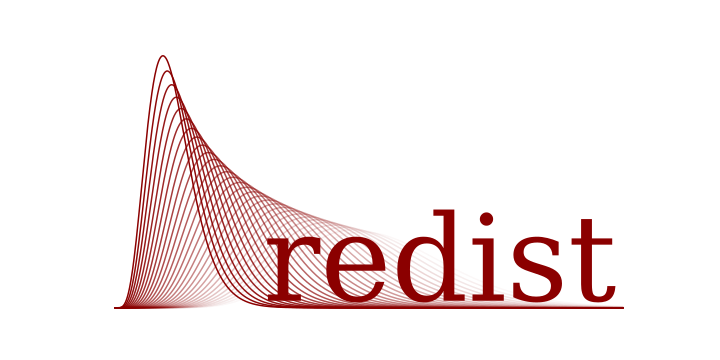

<!-- <h1 align="center">
  <br>
  
</h1> -->


<h3 align="center">A novel reinterpretation method for high-energy physics results.</h4>

## Overview
This is the implementation of a reweighing method for the reinterpretation of binned analyses in high energy physics. The method is based on calculating the change in the distributions of observables, given changes in the decay channel's kinematic distributions.

**Check out the paper [here](https://arxiv.org/pdf/2402.08417.pdf).**

## Dependencies
This implementation is based on the [pyhf](https://github.com/scikit-hep/pyhf) software for statistical inference. The [examples](examples) use the [EOS](https://github.com/eos/eos) software to calculate theoretical predictions.

## Installation

```bash
# Clone this repository
git clone https://github.com/lorenzennio/redist.git

# Install
pip install -e redist
```
## Contact

If you come across a bug, have an issue or a question, please file an [issue](https://github.com/lorenzennio/redist/issues/new). For further inquiries, you can talk to us via [Discord](https://discord.gg/bmaVUQcR4w).


## License

MIT
