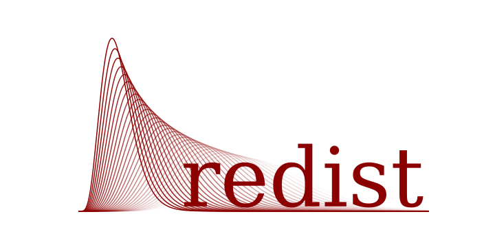

<!-- <h1 align="center">
  <br>
  
</h1> -->


<h3 align="center">A novel reinterpretation method for high-energy physics results.</h4>

## Overview
This is the implementation of a reweighing method for the reinterpretation of binned analyses in high energy physics. The method is based on calculating the change in the distributions of observables, given changes in the decay channel's kinematic distributions.

**Check out the paper [here](https://arxiv.org/pdf/2402.08417.pdf).**

## Installation

You can install `redist` from `pypi`

```bash
pip install redistpy
```

### Manual installation

You can install manually with
```bash
# Clone this repository
git clone https://github.com/lorenzennio/redist.git

# Install
pip install -e redist
```

## Dependencies
This implementation is based on the [pyhf](https://github.com/scikit-hep/pyhf) software for statistical inference. The [examples](examples) use the [EOS](https://github.com/eos/eos) software to calculate theoretical predictions.

### Gradients with JAX (optional)

`redist` runs on any `pyhf` backend. On the JAX backend the likelihood becomes
differentiable, so it can be used with `jax.grad`, `jax.jit` and `jax.vmap`:

```bash
pip install redistpy[jax]
```

```python
import pyhf, jax, jax.numpy as jnp
from redist import modifier

pyhf.set_backend("jax")          # set the backend *before* building the modifier

model = modifier.load("model.json", alt_dist, null_dist)
grad = jax.grad(lambda pars: model.logpdf(pars, data)[0])(pars)
```

The distributions must accept broadcast arrays and be written with operations
JAX can trace: `jax.numpy` rather than `scipy`, and no Python `if` on parameter
values. Adaptive quadrature cannot be traced, so the fallback described below
does not apply here.

Theory codes that are not written in JAX — `EOS`, for example — therefore
cannot be differentiated through. Using them still works on the NumPy backend.

### Bayesian inference (optional)
If you want to perform Bayesian inference with `redist` (or `pyhf`) you'll need to install `bayesian_pyhf`. 

You can do so with::
```bash
pip install git+https://github.com/malin-horstmann/bayesian_pyhf.git
```

For visualization of the posterior distribution, `corner` is very useful:

```bash
pip install corner
```

### Bin integrals

The bin integrals use fixed-order Gauss-Legendre quadrature, which calls each
distribution once with one broadcast array per kinematic dimension. A theory
code that can only be evaluated a point at a time — `EOS`, for example — is
detected when the modifier is built and falls back to adaptive quadrature, one
to two orders of magnitude slower. `cmod.quad` reports which rule was picked,
and `quad="gauss"` or `quad="nquad"` forces one.

## Contact

If you come across a bug, have an issue or a question, please file an [issue](https://github.com/lorenzennio/redist/issues/new). For further inquiries, you can talk to us via [Discord](https://discord.gg/bmaVUQcR4w).


## License

MIT
